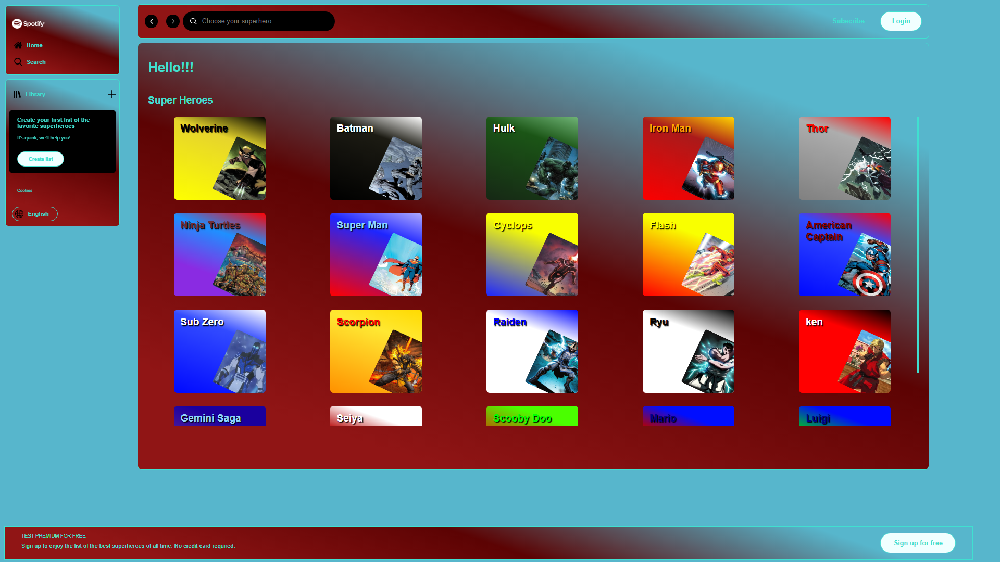

# Projeto site modelo Spotify

 > ℹ️ **NOTE:** Este é um repositório desenvolvido durante os meus estudos da imersão Spotify da [ALURA](https://www.alura.com.br/)

## ✨ Features
✅ Bem vindos! Este é um projeto com o objetivo de criar um site modelo Spotify utilizando html, css, javascript e react. Pude aprender a manipular várias tags, textos e cores, introduzir técnicas, além das que já estavam sendo utilizadas na imersão, foi bastante desafiante e muito enriquecedor. Minha gratidão a Deus e a Alura pela oportunidade.

✅ Welcome! This project aims to create a model Spotify website using HTML, CSS, JavaScript and React. I was able to learn how to manipulate various tags, texts, colors and introduce techniques beyond those used in the immersion. It was quite challenging and very enriching. My gratitude goes to God and Alura for the opportunity.

<a href="https://project-spotify-imersao-alura.vercel.app/" title="View Project now"> 📟 Clique aqui para visualizar a aplicação</a> 
<a href="https://github.com/VictorSamuraiWol/project-spotify-imersao-alura" title="View Repository now"> 📜 Clique aqui para visualizar o reposiório</a>

## 💻 Tecnologias utilizadas no projeto

- [Trello](https://trello.com/) 
- [Figma](https://www.figma.com/)
- [Visual Studio Code](https://code.visualstudio.com/)
- [HTML](https://html.com/) 
- [CSS](https://www.w3.org/Style/CSS/Overview.en.html)
- [JavaScript](https://www.javascript.com/)
- [React](https://react.dev/)
- [Github](https://github.com/)
- [Vercel](https://vercel.com/)

##  AWS Certified Cloud Practitioner, AWS Cloud Computing and Front-End Student 
 

    
    
&nbsp&nbsp&nbspVictor Cardoso 
    &nbsp&nbsp&nbsp
    <a 
        href="https://github.com/VictorSamuraiWol">
        GitHub
    </a>
    &nbsp;|&nbsp;
    <a 
        href="https://www.linkedin.com/in/victor-cardoso-cloud-front/">
        LinkedIn
    </a>
    &nbsp;|&nbsp;
    

 

---

⌨️ com 💚 por [Victor Cardoso](https://github.com/VictorSamuraiWol)
